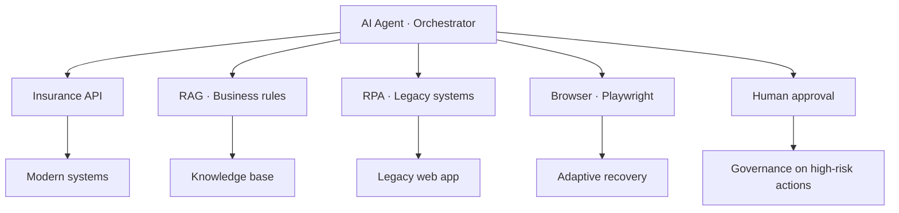
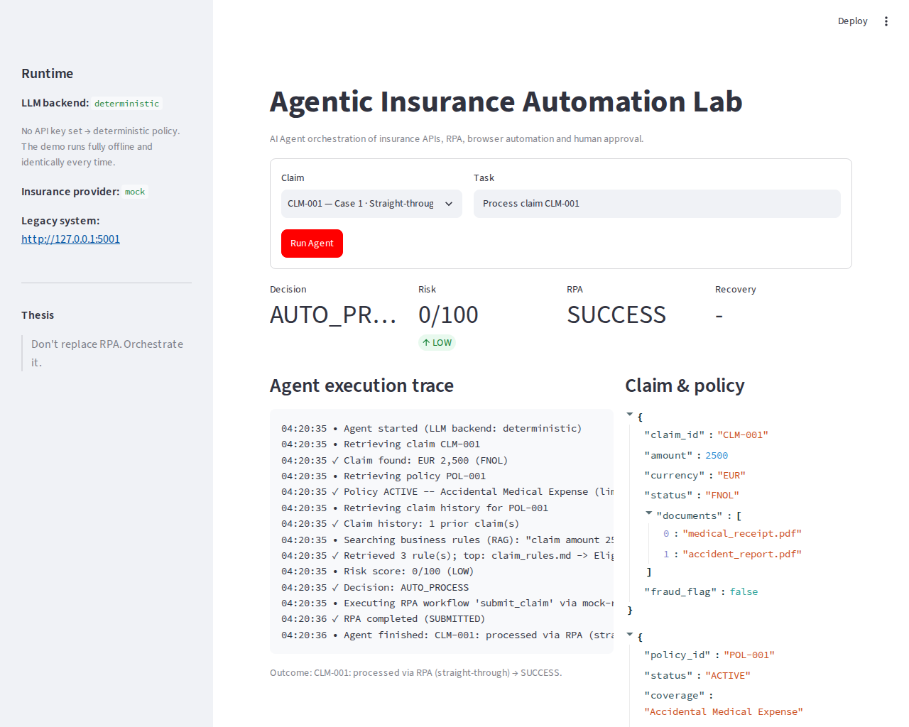
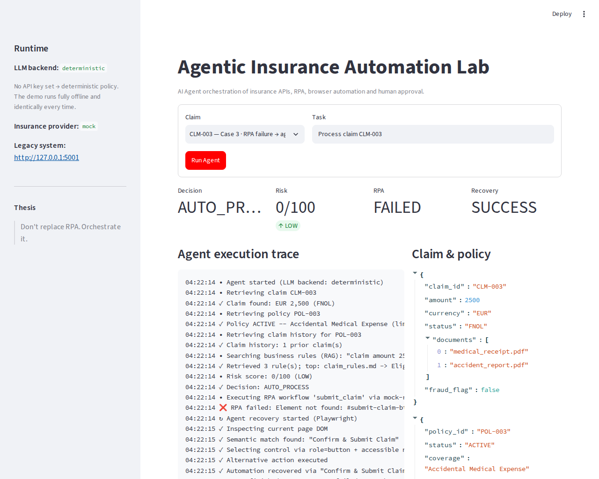
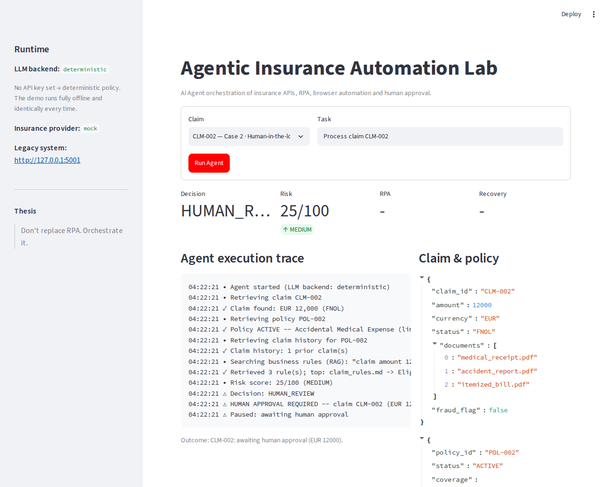
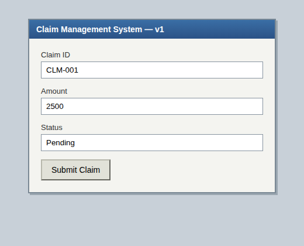
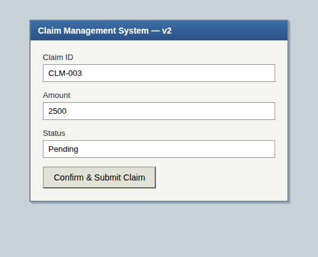

# Agentic Insurance Automation Lab

### From Traditional RPA to Agentic Automation

> **Don't replace RPA. Orchestrate it.**

An independent, self-contained proof-of-concept showing how an AI Agent can
orchestrate **insurance APIs, retrieval-augmented business knowledge (RAG),
traditional RPA, adaptive browser automation, and human approval** across a
synthetic insurance-claims workflow.

The point is *not* that AI replaces RPA. It's the opposite: when a carrier has
already invested heavily in deterministic RPA, the highest-leverage move is to
put an intelligent **orchestration layer** on top of it — one that understands,
plans, retrieves the governing rules, routes to the right execution tool, and
recovers when a brittle automation breaks.



| | |
|---|---|
|  |  |
| **Case 1** — low-risk claim runs straight through RPA | **Case 3** — RPA breaks on a changed UI, the agent recovers |

---

## 1. Project Overview

The app is a single Streamlit UI: **Insurance Claim Triage & Automation**. You
enter a claim id (or `Process claim CLM-001`), and a lightweight tool-calling
agent retrieves the claim and policy, pulls the governing rules from a knowledge
base, computes a **deterministic** risk score and decision, and then selects and
executes the right tool — RPA, browser recovery, or a human approval gate.

Everything runs locally with **synthetic data**. It needs **no API key** to run
(a deterministic backend drives the identical agent loop), and it needs **no
proprietary system**.

## 2. Why Agentic Automation?

Traditional RPA is superb at what it is designed for:

```
fixed process  ->  fixed rules  ->  fixed selectors  ->  execute
```

It becomes brittle the moment it meets unstructured information, changing
business rules, a UI that shifts, an exception path, or a decision that needs
context. Agentic automation keeps RPA for what it's good at and adds a reasoning
layer around it:

| Layer | Responsibility |
|-------|----------------|
| **AI Agent** | understand, plan, select tools, handle exceptions |
| **RAG** | retrieve the business rules that justify a decision |
| **API** | direct, structured access to modern systems |
| **RPA** | deterministic, repeatable operations on legacy systems |
| **Playwright** | adaptive browser automation & recovery when RPA breaks |
| **Human** | approval/governance for high-risk or ambiguous cases |

> **Playwright does not replace RPA. It complements RPA when deterministic
> automation becomes brittle.**

## 3. Architecture

```mermaid
flowchart TD
    U[User: "Process claim CLM-001"] --> AG

    subgraph AG[AI Agent]
      P[Plan / Reason] --> TR[Tool Router]
    end

    TR -->|data| API[Insurance API tools]
    TR -->|rules| RAG[RAG retriever]
    TR -->|score & decision| RISK[Deterministic risk engine]
    TR -->|deterministic exec| RPA[RPA adapter]
    TR -->|adaptive recovery| PW[Playwright recovery]
    TR -->|high risk / high value| HUM[Human approval]

    API --> BE[(Insurance backend: mock / Facio)]
    RAG --> KB[(knowledge/*.md)]
    RPA --> LEG[Legacy web app]
    PW --> LEG
    RPA -. selector broke .-> PW
```

The agent loop is deliberately small and backend-agnostic. Each step, the active
LLM backend is shown the task plus a structured snapshot of state and the tool
catalogue, and returns **one** next tool (or a final answer). Governance is
enforced in code, not on the model's goodwill (see §9).

## 4. Demo Scenarios

Three cases, selectable in the UI:

### Case 1 — Straight-through processing (`CLM-001`)
Low value (EUR 2,500), active policy, documents complete, no fraud → risk `LOW`
→ decision `AUTO_PROCESS` → RPA submits to the legacy system → **SUCCESS**.

```
✓ Claim found: EUR 2,500 (FNOL)
✓ Policy ACTIVE -- Accidental Medical Expense (limit EUR 50,000)
✓ Retrieved 3 rule(s); top: claim_rules.md -> Eligibility for automatic processing
✓ Decision: AUTO_PROCESS
✓ RPA completed (SUBMITTED)
```

### Case 2 — Human-in-the-loop (`CLM-002`)
High value (EUR 12,000) exceeds the EUR 5,000 auto limit → decision
`HUMAN_REVIEW` → the agent **pauses** and requests explicit approval. It cannot
proceed to RPA until a human approves.



### Case 3 — RPA failure → agent recovery *(the highlight)*
Low value, but the legacy claim screen has **changed**. The brittle RPA selector
(`#submit-claim-btn`, "Submit Claim") no longer matches. The agent detects the
failure, inspects the live page, finds the semantically equivalent control
("Confirm & Submit Claim") and completes the action.

| Legacy v1 (RPA recorded here) | Legacy v2 (UI changed) |
|---|---|
|  |  |

```
❌ RPA failed: Element not found: #submit-claim-btn
↻ Agent recovery started (Playwright)
✓ Inspecting current page DOM
✓ Semantic match found: "Confirm & Submit Claim"
✓ Selecting control via role=button + accessible name
✓ Automation recovered via "Confirm & Submit Claim"
```

## 5. Technology Stack

- **Python 3.11+**
- **Streamlit** — the UI.
- **Flask** — the local "legacy" claim-management system (with v1/v2 UI variants).
- **Playwright** — RPA execution *and* adaptive recovery against the legacy app.
- **Three interchangeable LLM backends**, same agent loop, same tool set:
  - **Anthropic Claude** *(optional)* — real tool-calling.
  - **Any OpenAI-wire-compatible provider** *(optional)* — DeepSeek / 通义千问
    (Qwen) / Kimi (Moonshot) / 智谱 GLM / a custom endpoint. Anthropic's API is
    not reliably reachable from mainland China, so for a China deployment this
    is the practical default — one backend implementation, swapped by
    `base_url` + `model` (see §11). DeepSeek is the pre-configured default:
    confirmed cheapest mainstream option with tool-calling support (verified
    against its [official pricing page](https://api-docs.deepseek.com/quick_start/pricing/)).
  - **Deterministic** *(no key, no network)* — the default fallback; the demo
    always runs end-to-end even with zero configuration.
- **Pure-Python TF-IDF retriever** — offline RAG (a FAISS/embeddings backend is a
  documented drop-in).

No LangChain / LangGraph / AutoGen / CrewAI — the agent loop is hand-written so a
reviewer can read exactly how tool selection works. No Kubernetes, microservices,
or heavyweight vector DB.

## 6. RAG (retrieval-augmented rules)

Business rules live in `knowledge/*.md` (`claim_rules`, `approval_rules`,
`document_requirements`, `escalation_rules`). `rag/ingest.py` chunks them by
section; `rag/retriever.py` exposes a `Retriever` interface with a default
`LexicalRetriever` (TF-IDF cosine, no external services). The agent decides on
**retrieved evidence**, not on the model's memory, and that evidence is shown to
the human adjuster in the approval panel.

Swapping to embeddings + FAISS means implementing `FaissRetriever.search`
(skeleton included) — the return type never changes, so nothing else does.

## 7. Agent Tool Routing

`agent/router.py` is the explicit policy that makes the thesis concrete: **RPA is
one tool the agent routes to, not the agent itself.**

| Situation | Routes to |
|-----------|-----------|
| Need claim / policy / history | Insurance API tools |
| Need the governing rules | RAG (`search_rules`) |
| Need a score & decision | Deterministic risk engine (`calculate_risk`) |
| Decision = `AUTO_PROCESS` | RPA (`execute_rpa`) |
| RPA failed on a changed UI | Browser recovery (`browser_recover`) |
| Decision = `HUMAN_REVIEW` | Human approval (`request_human_approval`) |

## 8. RPA + Browser Recovery

`rpa/interface.py` defines a product-agnostic `RPAAdapter.execute_workflow`. The
only implementation here is `MockRPAAdapter`, which drives the local legacy app
through a single **hard-coded selector** — deliberately mimicking classic,
brittle RPA. When the UI changes, it fails with "element not found".

`browser/recovery.py` does the opposite: it **inspects the live page**,
enumerates the actionable controls, and picks the semantically equivalent one,
preferring accessible `role=button[name]` selectors over coordinates.

```
RPA        = deterministic, selector-bound, breaks on UI change
Playwright = inspects + adapts, recovers from the same UI change
```

## 9. Human-in-the-loop

`request_human_approval` packages the claim, amount, risk, decision, reasons and
retrieved evidence, then **pauses** the run. Crucially, the approval gate is
enforced by an in-code **guardrail** in `agent/agent.py`: even a misbehaving LLM
that tries to call `execute_rpa` on a high-value claim is redirected to request
approval. This is covered by a test (`test_guardrail_blocks_rpa_bypass_on_high_value`).

## 10. Running Locally

```bash
# 1. Install
pip install -r requirements.txt
playwright install chromium

# 2. (optional) configure — the demo runs with NO config at all
cp .env.example .env
# Option A: add ANTHROPIC_API_KEY to use real Claude
# Option B (recommended in mainland China): set LLM_MODE=openai_compatible and
#   LLM_API_KEY=<your key> — LLM_PROVIDER defaults to deepseek

# 3. Run
streamlit run app.py      # or:  python app.py
```

Then pick a claim and click **Run Agent**. The legacy Flask app is started
automatically. To run it standalone: `python legacy_app/app.py`.

```bash
# Tests (no browser required — 30 tests)
pytest -q
```

## 11. Configuration

All via environment variables / `.env` (see `.env.example`). Nothing secret is
hard-coded.

| Variable | Default | Purpose |
|----------|---------|---------|
| `LLM_MODE` | `auto` | `auto` / `anthropic` / `openai_compatible` / `deterministic` |
| `ANTHROPIC_API_KEY` | — | enables the real Claude backend |
| `ANTHROPIC_MODEL` | `claude-sonnet-4-20250514` | model id |
| `LLM_PROVIDER` | `deepseek` | `deepseek` / `qwen` / `kimi` / `zhipu` / `custom` |
| `LLM_API_KEY` | — | API key for the selected OpenAI-compatible provider |
| `LLM_MODEL` / `LLM_BASE_URL` | preset default | override the provider's default |
| `INSURANCE_PROVIDER` | `mock` | `mock` / `facio` |
| `FACIO_API_KEY` | — | required only for the Facio sandbox |
| `LEGACY_HOST` / `LEGACY_PORT` | `127.0.0.1` / `5001` | legacy app |
| `PLAYWRIGHT_HEADLESS` | `true` | headful for a live demo |

### Why DeepSeek is the default (not Anthropic)

Anthropic's API is not reliably reachable from mainland China. Every mainstream
Chinese model API (DeepSeek, 通义千问/Qwen via DashScope's compatible mode, Kimi,
智谱 GLM) speaks the exact same OpenAI `chat.completions` wire format with tool
calling, so `llm/openai_compatible.py` is **one** implementation that works with
all of them — just point `LLM_PROVIDER` at a different preset. DeepSeek ships as
the default because, checked against its official pricing page, it's currently
the cheapest mainstream option that still supports tool calling reliably. Model
ids and prices in this market move fast — the presets in `config.py` link to
each provider's docs so you can re-verify before a real deployment.

## 12. Project Structure

```
agentic-insurance-automation/
├── app.py                 # entry point (streamlit run app.py | python app.py)
├── config.py              # env-driven settings (incl. multi-backend LLM mode)
├── agent/                 # agent loop, router, state, prompts, trace
├── llm/                   # backend abstraction: anthropic + openai-compatible (DeepSeek/Qwen/Kimi/GLM) + deterministic
├── tools/                 # the tool catalogue the agent selects from
├── insurance/             # provider abstraction: mock + Facio skeleton
├── rag/                   # ingest + retriever (lexical default, FAISS skeleton)
├── risk/                  # deterministic risk & decision engine
├── rpa/                   # RPAAdapter interface + MockRPAAdapter
├── browser/               # Playwright driver + adaptive recovery
├── legacy_app/            # Flask "legacy" claim system (v1/v2 UI)
├── knowledge/             # business rules (RAG source)
├── data/                  # synthetic demo claims
├── ui/                    # Streamlit UI
└── tests/                 # pytest suite
```

## 13. Design Decisions

- **Deterministic business logic, not LLM guesses.** Risk score and routing
  decision come from `risk/engine.py`. The LLM orchestrates and explains; it
  never invents the number that moves money.
- **Three-way LLM backend, one agent loop.** Real Claude, any OpenAI-wire-
  compatible provider (DeepSeek/Qwen/Kimi/GLM), or a deterministic policy all
  drive the *identical* agent loop and tool set. The demo is therefore reliable
  in a live interview even with no key and no network, and swapping to a
  China-reachable model is a config change, not a code change.
- **State-snapshot agent loop.** Each step re-derives from an explicit
  `AgentState`, which makes the human-in-the-loop pause cleanly resumable.
- **Governance in code.** The human-approval gate is a guardrail, not a prompt
  request.
- **Clean seams.** Insurance provider, RPA adapter, RAG retriever, and LLM
  backend are all interfaces with a mock/default implementation and a
  documented plug-in point.

## 14. Limitations

- The insurance backend is a synthetic mock; the Facio adapter is a skeleton.
- The RPA layer is a **mock adapter**, not a real enterprise RPA product.
- The knowledge base is small and curated; the default retriever is lexical.
- The legacy app is a minimal stand-in for a real legacy system.

## 15. Future Work

- Plug a real enterprise RPA adapter into `RPAAdapter` (UiPath / 艺赛旗 iS-RPA /
  影刀 / Automation Anywhere).
- Wire the Facio sandbox (or a real carrier API) into `insurance/facio_client.py`.
- Swap the lexical retriever for embeddings + FAISS via `FaissRetriever`.
- Add document understanding (OCR/extraction) for the claim attachments.
- Persist runs and add an audit log for approvals.

## 16. Disclaimer

> This is an **independent technical proof-of-concept** using **synthetic /
> public-sandbox data**. It does **not** use or reproduce any proprietary
> systems, data, processes, or credentials, and it is **not** an official product
> of any company. The "RPA" layer is a mock adapter designed as an integration
> boundary; it is not a real enterprise RPA product.

---

### Key Insight

> The goal is not to replace RPA with AI. The goal is to make RPA **one of
> several execution capabilities** available to an intelligent orchestrator —
> so a carrier's existing automation investment is *extended*, not thrown away.
