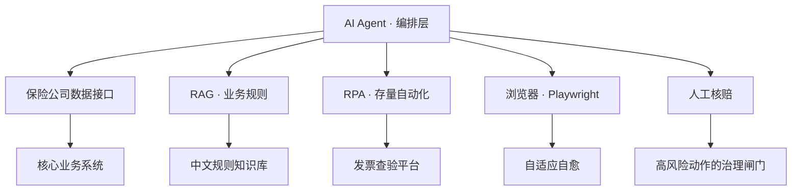
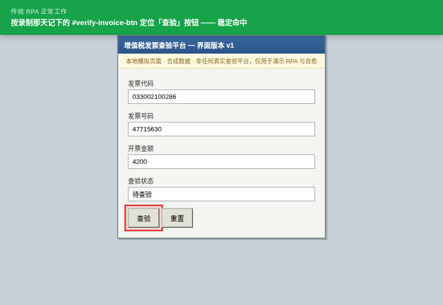
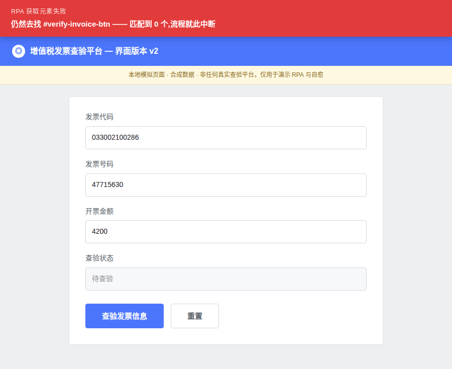
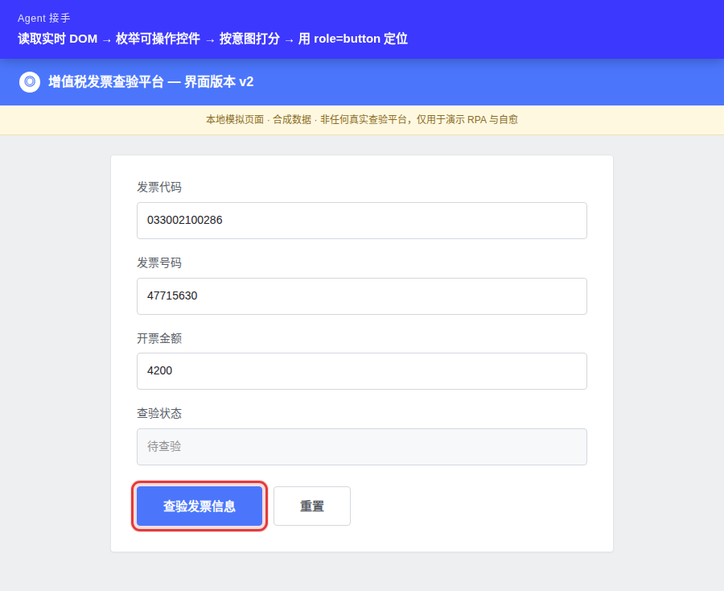
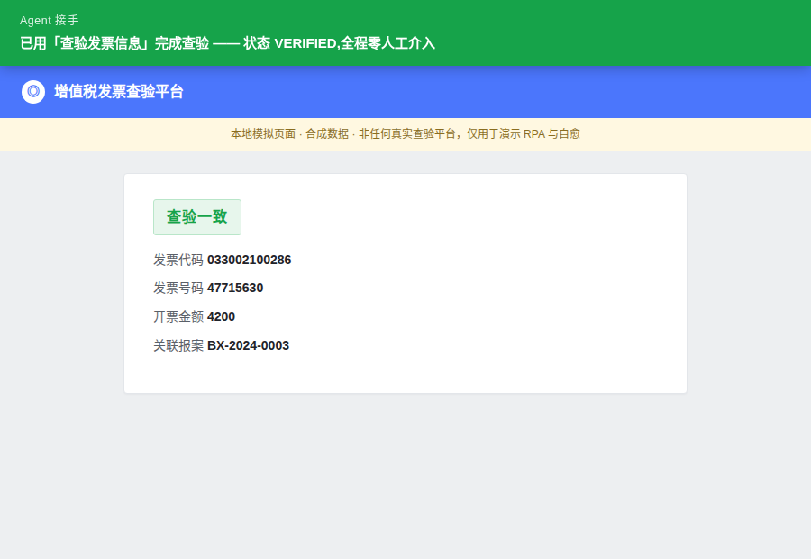
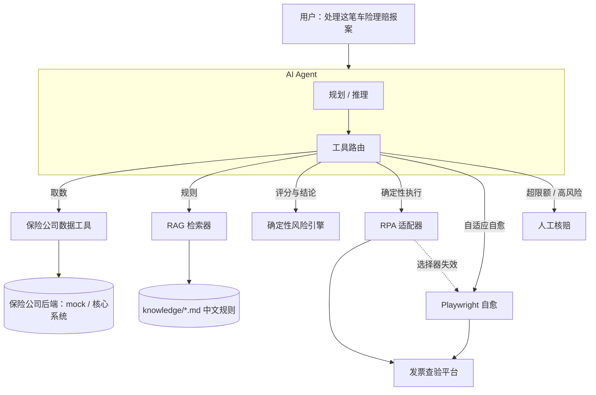

# 车险理赔 Agent 自动化实验台

### Agentic Insurance Automation Lab — From Traditional RPA to Agentic Automation

> **不是取代 RPA，而是给 RPA 装上大脑。**
> *Don't replace RPA. Orchestrate it.*

**[▶ 在线演示 / Live demo](https://jack-cuixiaodong.github.io/agentic-insurance-automation/)**
　·　全部本地运行 · 全合成数据 · **无需任何 API Key**

两个 demo，各回答一个传统 RPA 回答不了的问题：

| | 问题 | 这里怎么解 |
|---|---|---|
| **Demo 1**<br>Agent 获取元素 | 网页改版了，写死选择器的机器人当场瘫痪，怎么办？ | Agent 读实时 DOM、按语义找回控件，**在同一张让 RPA 崩掉的页面上**就地续跑 |
| **Demo 2**<br>业务知识库 | 每上一个新流程都要重新提需求、人肉翻译业务逻辑，怎么办？ | 规则就是业务人员写的中文文档，系统直接读。一句话提问，秒回条款、出处与原文 |

一个独立、自包含的技术验证：AI Agent 如何编排**保险公司业务数据、RAG 业务规则检索、
传统 RPA、自适应浏览器自动化、以及人工核赔**，跑通一条合成的车险理赔流水线。

论点不是"AI 取代 RPA"，恰恰相反：当一家保险公司已经在确定性 RPA 上投入很深时，
最高杠杆的做法是在它**上面**加一层智能编排层——能理解、能规划、能检索出决策依据、
能路由到正确的执行工具，并且在脆弱的自动化断掉时自己想办法。



---

## 先看这个 · 一次真实运行，从头到尾

整场只开了**一个浏览器、一个标签页**。页面在机器人脚下改版，它当场崩掉，
然后 Agent 就地把断掉的流程接了回去——中间没有重来一次。
下面四张截图全部来自这次运行，不是效果图，也不是分镜。

<table>
<tr>
<td width="50%"><b>① 传统 RPA 正常工作</b><br><br>

<br><sub>录制时记下的「查验」按钮——红框就是 RPA 定位到的元素</sub></td>
<td width="50%"><b>② 网页系统更新，RPA 获取元素失败</b><br><br>

<br><sub>改版后的新页面——<code>#verify-invoice-btn</code> 匹配到 0 个，流程停在这里</sub></td>
</tr>
<tr>
<td><b>③ Agent 就地接手</b><br><br>

<br><sub>读实时 DOM、按意图打分、用 <code>role=button</code> + 可访问名称定位——红框是它自己找回来的</sub></td>
<td><b>④ 断掉的流程接上了</b><br><br>

<br><sub>查验一致，全程零人工介入</sub></td>
</tr>
</table>

**改版只动了按钮怎么称呼自己**——字段名、表单提交地址、页面结构全都没变，
接口层面看不出任何异样。而这恰恰是写死选择器的机器人唯一认得的东西：

| 项目 | 改版前 v1 | 改版后 v2 |
|---|---|---|
| 主按钮文案 | 查验 | **查验发票信息** |
| 主按钮 id | `#verify-invoice-btn` | **`#check-invoice-btn`** |
| 表单字段名 | `invoice_code / invoice_no / amount` | 完全一致 |
| 表单提交地址 | `POST /verify` | 完全一致 |

> **Agent 没有猜，也没有用坐标。** 它读取实时 DOM，枚举页面上所有可操作控件，
> 按意图关键词打分（「查验发票信息」11 分，「重置」0 分），选出最高的那个，
> 再用 `role=button` + 可访问名称去定位。
>
> 定位锚在「人怎么读这个按钮」上，而不是「开发当时怎么命名它」上：
> id 和 class 可以随便改，按钮上写给人看的那几个字不会——一变，用户就不认识这个页面了。

在界面里点 **「▶ 三幕演示」** 可以自己跑一遍；勾上「显示浏览器窗口」还能
亲眼看着它慢动作定位、点击。

---

## 第二个 demo · 规则不该只活在开发的脑子里

第一个 demo 解决的是「页面变了怎么办」。这一个解决的是更贵的那个问题：**业务规则怎么进系统**。

| 传统 RPA 怎么做 | 这套系统怎么做 |
|---|---|
| 每上一个新流程，业务规则要经过一次人肉翻译：业务人员口述 → 需求文档 → 开发理解 → 写成脚本里的 if-else。规则从此只活在两个地方——业务人员的脑子里，和外人读不懂的代码里。中间那次翻译，就是误解的来源；规则一改，整条链路重来一遍。 | 规则就是业务人员自己写的中文文档（`knowledge/*.md`），系统直接读，不经过翻译。用一句话提问，秒级返回适用条款、出处文件和原文措辞。加一条规则不用改代码，改一条规则不用重新提需求。 |

界面里切到 **「问规则 · 业务知识库」** 标签页，输入一句话：

> **问：8 万元的车损案子要不要转人工核赔？**
>
> `核赔权限.md` → **转人工核赔的金额与风险门槛**　相关度 0.166
> 赔付金额**超过人民币 10,000 元**的报案，须由核赔员人工审核后方可赔付。
>
> `理赔规则.md` → **金额门槛**　相关度 0.145
> 赔付金额**超过 10,000 元**的，必须转人工核赔。

命中的词在原文里高亮，用的是检索器打分所依据的**同一批片段**——展示的是「为什么这条命中了」，
不是事后另编一套好看的解释。旁边有「重新加载知识库」按钮：改完规则文档点一下，
不重启、不改代码，下一次检索就能找到新条款。

> **说清楚边界**：检索出来的是**依据**，不是**决定**。动钱的判断——自动核赔限额、风险评分、
> 能不能直通——由 `risk/engine.py` 里的确定性代码执行，代码里的常量和文档里的措辞刻意保持一致。
> 理由很简单：**规则文档应该好改，护栏不应该好改。**

---

### 界面总览

| | |
|---|---|
|  |  |
| **案例 1** — 小额低风险，快速理赔直通 | **案例 3** — 查验平台改版，RPA 断了，Agent 自愈 |

---

## 1. 项目概览 · Overview

一个 Streamlit 单页应用：**车险理赔智能分流与自动化**。交给它一句话（`处理这笔车险理赔报案`），
一个轻量的 tool-calling Agent 会取出报案与保单、从知识库
检索适用的业务规则、用**确定性**引擎算出风险分和核赔结论，然后选择并执行正确的工具
——RPA 发票查验、浏览器自愈，或者人工核赔闸门。

全部本地运行、**全合成数据**、**不需要任何 API Key**（内置确定性后端驱动完全相同的
Agent 循环）、**不依赖任何专有系统**。

## 2. 为什么需要 Agentic 自动化

传统 RPA 在它被设计的场景里非常好用：

```
固定流程  ->  固定规则  ->  固定选择器  ->  执行
```

一旦遇到非结构化信息、变化的业务规则、改版的页面、异常分支，或者需要上下文才能做的
判断，它就会变脆。Agentic 自动化保留 RPA 擅长的部分，在外面套一层推理：

| 层 | 职责 |
|-------|------|
| **AI Agent** | 理解、规划、选工具、处理异常 |
| **RAG** | 检索出支撑这个结论的业务规则原文 |
| **数据接口** | 结构化访问核心业务系统 |
| **RPA** | 对存量系统做确定性、可重复的操作 |
| **Playwright** | 自适应浏览器自动化；RPA 断了之后接管 |
| **人工** | 高金额 / 高风险案件的审批与治理 |

> **Playwright 不是用来取代 RPA 的。它是在确定性自动化变脆时补位的。**

## 3. 架构 · Architecture



Agent 循环刻意做得很小，且与后端无关。每一步把任务、结构化的状态快照、工具目录交给
当前 LLM 后端，后端返回**一个**下一步工具（或收尾）。治理由代码强制执行，不依赖模型
自觉（见 §9）。

## 4. 演示场景 · Demo Scenarios

界面里两个 demo：**Demo 1 · Agent 获取元素**（下面的「自愈」）和
**Demo 2 · 业务知识库**。Demo 1 底下还能跑完整流水线，走出三种路由结果——
它们**不是三个 demo**，是同一条流水线的三种结局：

### 直通 —— 小额低风险，自动核赔
小额（¥3,800）、保单有效、单证齐全、无欺诈标记 → 风险 `低` → 结论 `自动核赔` →
RPA 到查验平台验维修发票 → **成功**。

```
✓ 报案已找到：沪AX0001 ¥3,800（待核赔）
✓ 保单有效 —— 机动车损失保险（保额 ¥500,000，免赔 ¥500）
✓ 命中 3 条规则；最相关：核赔权限.md → 转人工核赔的金额与风险门槛
✓ 核赔结论：自动核赔
✓ RPA 执行完成（VERIFIED）
```

### 闸门 —— 金额超限，转人工核赔
金额 ¥86,000 远超 ¥10,000 自动核赔限额 → 结论 `人工核赔` → Agent **暂停**并打包一份
审批材料给核赔员。在人工通过之前，它无法继续执行 RPA。


### 自愈 —— 网页改版，RPA 中断后 Agent 接手 *（这就是 Demo 1）*
金额不高，本可直通，但**增值税发票查验平台改版了**。写死的 RPA 选择器
（`#verify-invoice-btn`，「查验」）不再匹配。Agent 检测到失败，读取实时页面，
找到语义等价的控件（「查验发票信息」），完成操作。

```
❌ RPA 失败：元素未找到：#verify-invoice-btn（该页面上已不存在原「查验」按钮）
↻ 启动浏览器自愈（Playwright）
✓ 读取当前页面 DOM
✓ 语义匹配命中：「查验发票信息」
✓ 按 role=button + 可访问名称定位控件
✓ 自动化已恢复，改用「查验发票信息」完成查验
```

| 改版前 v1（RPA 当初照着它录的） | 改版后 v2（整站换了设计语言） |
|---|---|
|  |  |

改版只动了皮肤和主按钮的文案 / ID，**字段名、表单 action、页面结构一个都没变**——
这恰恰是最难缠的一类改版：接口层面看不出任何异样，人打开还是那个页面，
只有认死选择器的机器人集体倒下。

**为什么选发票查验做这个场景**：它是国内后台自动化里 RPA 密度最高的环节之一——
查验平台只提供网页、不提供数据接口，只能靠 RPA 点；而平台页面结构调整会在同一个早上
让各家的查验机器人集体罢工。这不是假设，是常态。

## 5. 技术栈 · Stack

- **Python 3.11+**
- **Streamlit** — 界面
- **Flask** — 本地模拟的「增值税发票查验平台」（含 v1/v2 两套界面）
- **Playwright** — RPA 执行 *与* 自适应自愈
- **三套可互换的 LLM 后端**，同一个 Agent 循环、同一套工具：
  - **Anthropic Claude** *（可选）*
  - **任何 OpenAI 协议兼容的厂商** *（可选）* — DeepSeek / 通义千问 Qwen / Kimi /
    智谱 GLM / 自建端点。国内部署这是实际默认项，一套实现靠 `base_url` + `model`
    切换（见 §11）。DeepSeek 是预置默认。
  - **确定性后端** *（无 Key、无网络）* — 默认兜底，零配置也能端到端跑完。
- **纯 Python TF-IDF 检索器** — 离线 RAG，**支持中文分词**（字级 unigram + bigram，
  不引入分词库）。FAISS/embeddings 后端是文档化的 drop-in 扩展点。

没有 LangChain / LangGraph / AutoGen / CrewAI —— Agent 循环是手写的，方便逐行读懂
工具选择是怎么发生的。没有 K8s、微服务、重型向量库。

## 6. RAG（检索式规则依据）

业务规则放在 `knowledge/*.md`（`理赔规则`、`核赔权限`、`单证要求`、`发票查验规则`、
`转人工规则`）。`rag/ingest.py` 按章节切块；`rag/retriever.py` 暴露 `Retriever` 接口，
默认实现是 `LexicalRetriever`（TF-IDF 余弦，无外部服务）。

> **中文分词说明**：默认的 Latin-only 分词器对中文会返回空 token，导致所有向量为空、
> 检索静默返回 0 条。`_tokenize` 因此对 CJK 片段同时索引单字与相邻双字，
> 「自动核赔」这样的查询才能和「自动核赔限额」重叠命中。

Agent 是基于**检索到的依据**做决策，不是基于模型记忆；这份依据会原样出现在核赔员的
审批面板里。

## 7. 工具路由 · Tool Routing

`agent/router.py` 是把论点写成代码的地方：**RPA 是 Agent 可以路由到的一个工具，
不是 Agent 本身。**

| 情形 | 路由到 |
|------|--------|
| 需要报案 / 保单 / 历史出险 | 保险公司数据工具 |
| 需要适用的业务规则 | RAG（`search_rules`） |
| 需要风险评分与核赔结论 | 确定性风险引擎（`calculate_risk`） |
| 结论 = 自动核赔 | RPA 发票查验（`execute_rpa`） |
| RPA 因页面改版失败 | 浏览器自愈（`browser_recover`） |
| 结论 = 人工核赔 | 核赔员审批（`request_human_approval`） |

## 8. RPA + 浏览器自愈

`rpa/interface.py` 定义了与产品无关的 `RPAAdapter.execute_workflow`。默认实现是
`MockRPAAdapter`，它通过**一个写死的选择器**驱动本地模拟的查验平台——刻意还原经典的
脆弱 RPA。页面一改，它就报"元素未找到"。

`browser/recovery.py` 做的正相反：它**读取实时页面**，枚举可操作控件，挑出语义等价的
那个，优先使用可访问的 `role=button[name]` 而不是坐标。

```
RPA        = 确定性、绑定选择器、页面一改就断
Playwright = 读取 + 适应，能扛过同一次改版
```

> 意图关键词表（`_INTENT_KEYWORDS`）中文在前：这些页面是中文的，纯英文词表会把
> 每个中文按钮都打成 0 分，自愈会在一个明明有按钮的页面上报告"未找到"。

### 接真实 RPA：影刀（ShadowBot）

`RPAAdapter` 一直被说成「以后能换成企业 RPA 的接缝」。`rpa/shadowbot.py` 是第一个
真的接上去的实现——它通过影刀客户端自带的命令行触发一个已发布的影刀应用，轮询到
终态，再把结果翻译回同一个 `RPAResult`。

```bash
RPA_PROVIDER=shadowbot          # 默认仍是 mock
SHADOWBOT_APP_ID=<用 `console app` 查出来的应用 ID>
```

换后端**只动这两个环境变量**：Agent 循环、`tools/registry.py` 的工具目录、
`risk/engine.py` 的护栏，一行都不用改。这正是当初把接缝画在这里的理由。

三个刻意的克制，写在 `rpa/shadowbot.py` 的模块文档里：

- **不自动登录。** 预检发现没有影刀会话就直接失败，让运维去手工登录。无人值守的
  执行器不该持有账号密码——这比「跑得更顺」重要。
- **不臆造入参写法。** 影刀官方文档要求现场 `console task run --help` 确认入参
  flag，所以默认**不传业务参数**，配了 `SHADOWBOT_INPUT_FLAG` 才传。
- **不假设 JSON 外壳。** 按候选键名在整棵返回里找 `task_id` / `status`，认不出的
  任务状态一律按「还在跑」处理，绝不当成成功。

CLI 本身怎么用（登录恢复、`console app`、`console task` 各子命令）见
`.claude/skills/shadowbot-cli/`——那是影刀官方 skills 仓库的逐字副本加一份平台路由，
Claude Code 在本仓库里可以直接用它手工联调。

## 9. 人工核赔闸门 · Human-in-the-loop

`request_human_approval` 会把报案、金额、风险、结论、理由和检索到的规则依据打包，
然后**暂停**整个运行。关键在于这道闸门是 `agent/agent.py` 里的**代码级护栏**：
即便一个不听话的 LLM 直接调用 `execute_rpa`，也会被改道去请求审批。这一点有专门的
测试守着（`test_guardrail_blocks_rpa_bypass_on_high_value`）。

## 10. 本地运行 · Running Locally

```bash
# 1. 安装
pip install -r requirements.txt
playwright install chromium

# 2.（可选）配置 —— 零配置也能完整跑
cp .env.example .env
# 方式 A：设置 ANTHROPIC_API_KEY 使用真实 Claude
# 方式 B（国内推荐）：设置 LLM_MODE=openai_compatible 和
#   LLM_API_KEY=<你的 key>，LLM_PROVIDER 默认 deepseek

# 3. 运行
streamlit run app.py      # 或：python app.py
```

选一个案例，点 **▶ 三幕演示** 看 Agent 在网页改版后自己找回控件，或点 **运行 Agent**
跑完整流程。切到 **问规则** 标签页可以用一句中文查业务规则。
查验平台会自动拉起，单独运行它：`python legacy_app/app.py`。

> **`playwright install chromium` 拉不动？** 它要从境外 CDN 下 100 多 MB，国内经常失败。
> 跑一次 `python fix_browser.py`：它会检测 Playwright 自带的 Chromium 能不能用，
> 不行就去找机器上已有的 Edge / Chrome，能用就自动写进 `.env`（`PLAYWRIGHT_CHROMIUM_PATH`）。
> Edge 本身就是 Chromium 内核，Playwright 可以直接驱动，一个字节都不用下。
> 案例 2、3 不需要浏览器；只有 Demo 1 的浏览器自愈需要。

```bash
# 测试（不需要浏览器 —— 63 条）
pytest -q

# 分层导读：一次只点亮架构的一层
python walkthrough.py        # 列出全部 10 步
python walkthrough.py 5      # 只跑第 5 步（工具路由，最推荐先看）
python walkthrough.py 1-8    # 前 8 层，不需要浏览器
```

## 11. 配置 · Configuration

全部通过环境变量 / `.env`（见 `.env.example`）。没有任何硬编码的密钥。

| 变量 | 默认值 | 用途 |
|------|--------|------|
| `LLM_MODE` | `auto` | `auto` / `anthropic` / `openai_compatible` / `deterministic` |
| `ANTHROPIC_API_KEY` | — | 启用真实 Claude 后端 |
| `ANTHROPIC_MODEL` | `claude-sonnet-4-20250514` | 模型 id |
| `LLM_PROVIDER` | `deepseek` | `deepseek` / `qwen` / `kimi` / `zhipu` / `custom` |
| `LLM_API_KEY` | — | 所选 OpenAI 兼容厂商的 key |
| `LLM_MODEL` / `LLM_BASE_URL` | 预置默认 | 覆盖厂商预设 |
| `INSURANCE_PROVIDER` | `mock` | `mock` / `core` |
| `CORE_API_BASE_URL` / `CORE_API_KEY` | — | 仅在接保险公司核心系统时需要 |
| `LEGACY_HOST` / `LEGACY_PORT` | `127.0.0.1` / `5001` | 模拟查验平台 |
| `RPA_PROVIDER` | `mock` | `mock` / `shadowbot`（影刀） |
| `SHADOWBOT_APP_ID` | — | 要触发的影刀应用 ID，`shadowbot` 模式必填 |
| `SHADOWBOT_CLI` | — | 影刀 CLI 的绝对路径，留空则按平台在 PATH 上找 |
| `SHADOWBOT_INPUT_FLAG` | — | 传业务入参的 flag，留空则不传（见上文「三个克制」）|
| `SHADOWBOT_TIMEOUT` / `SHADOWBOT_POLL_INTERVAL` | `300` / `2` | 单次任务最长等待与轮询间隔（秒）|
| `PLAYWRIGHT_HEADLESS` | `true` | 现场演示可设 false 看真实点击 |
| `PLAYWRIGHT_CHROMIUM_PATH` | — | 指定已有的 Chromium/Chrome，用于沙箱 / CI 镜像 |

### 为什么默认 DeepSeek 而不是 Anthropic

Anthropic 的 API 在中国大陆无法稳定访问。国内主流模型 API（DeepSeek、通义千问
DashScope 兼容模式、Kimi、智谱 GLM）都说同一套 OpenAI `chat.completions` 协议且支持
tool calling，所以 `llm/openai_compatible.py` **一套实现**就能全部覆盖，切换厂商只需
改 `LLM_PROVIDER`。这个市场的模型 id 和价格变动很快——`config.py` 的预设里带了各厂商
文档链接，正式部署前请自行复核。

## 12. 目录结构 · Project Structure

```
agentic-insurance-automation/
├── app.py                 # 入口（streamlit run app.py | python app.py）
├── walkthrough.py         # 分层导读：一次只点亮一层
├── config.py              # 环境变量配置（含多后端 LLM 模式）
├── agent/                 # Agent 循环、路由、状态、提示词、执行轨迹
├── llm/                   # 后端抽象：anthropic + openai 兼容 + 确定性
├── tools/                 # Agent 可选的工具目录
├── insurance/             # 保险公司数据抽象：mock + 核心系统骨架
├── rag/                   # 切块 + 检索（中文词法默认，FAISS 骨架）
├── risk/                  # 确定性风险与核赔结论引擎
├── rpa/                   # RPAAdapter 接口 + MockRPAAdapter + 影刀适配器 + 后端工厂
├── browser/               # Playwright 驱动 + 自适应自愈
├── legacy_app/            # 模拟的增值税发票查验平台（v1/v2 两版界面）
├── knowledge/             # 中文业务规则（RAG 数据源）
├── data/                  # 合成演示报案
├── ui/                    # Streamlit 界面
├── docs/                  # GitHub Pages 落地页
├── .claude/skills/        # 影刀 CLI 技能（上游逐字副本 + 平台路由）
└── tests/                 # pytest 套件
```

## 13. 设计取舍 · Design Decisions

- **确定性业务逻辑，不是 LLM 猜测。** 风险分和核赔结论来自 `risk/engine.py`。
  LLM 负责编排和解释；它不产出那个动钱的数字。
- **三套 LLM 后端，一个 Agent 循环。** 真 Claude、任何 OpenAI 兼容厂商、或纯确定性
  策略，驱动的是*完全相同*的循环和工具集。所以没有 Key、没有网络也能可靠演示，
  换成国内可达的模型是配置变更而非代码变更。
- **状态快照式循环。** 每一步都从显式的 `AgentState` 重新推导，人工中断后能干净续跑。
- **治理写在代码里。** 人工核赔闸门是护栏，不是提示词里的请求。
- **干净的接缝。** 保险公司数据源、RPA 适配器、RAG 检索器、LLM 后端全是接口 + 默认实现 +
  文档化的替换点。业务场景本地化时，`agent/`、`llm/`、`tools/registry.py`
  这些架构层一行都没动过。
- **视觉上说保险的话。** 演示页、Streamlit 界面和查验平台 v2 统一采用国内保险 / 政务
  门户通行的设计语言（蓝色顶栏、面包屑、浅灰画布上的白卡片、实心蓝主按钮），
  让看的人第一眼就落在熟悉的业务语境里，而不是又一个开发者 demo。
  这是**设计语言**的借鉴，不是任何一家公司的品牌——页面不含任何真实机构的名称或标识。

## 14. 局限 · Limitations

- 保险公司后端是合成 mock；核心系统适配器是骨架。
- RPA 层默认是 **mock 适配器**，不是真实的企业 RPA 产品。影刀适配器
  (`rpa/shadowbot.py`) 的协议层有测试覆盖，但**尚未在装了影刀客户端的机器上联调过**
  ——CLI 的 JSON 信封和任务状态字面量按候选键名兼容处理，真机上仍需确认一次。
- 知识库规模小且经过整理；默认检索器是词法的（非语义向量）。
- 查验平台是最小化的本地模拟，**不是**任何真实平台，也没有使用其任何标识。

## 15. 后续方向 · Future Work

- 在装了影刀客户端的机器上把 `rpa/shadowbot.py` 真机跑通，确认入参 flag 与状态字面量。
- 按同样的方式再接一家企业 RPA（UiPath / 艺赛旗 iS-RPA / Automation Anywhere）。
- 把保险公司核心系统接入 `insurance/carrier_client.py`。
- 用 embeddings + FAISS 替换词法检索器（`FaissRetriever` 骨架已就位）。
- 加入单证理解（OCR / 要素抽取）处理定损单与发票影像。
- 持久化运行记录，为审批建立审计日志。

## 16. 免责声明 · Disclaimer

> 这是一个**独立的技术验证**，使用**全合成数据**。它**不**使用、也**不**复现任何专有
> 系统、数据、流程或凭据，**不是**任何公司的官方产品。报案号、保单号、车牌、发票号码
> 均为虚构。"RPA"层是按集成边界设计的 mock 适配器，不是真实的企业 RPA 产品。
> `legacy_app/` 是一个本地模拟页面，用于演示 RPA 脆断与自愈，**不是**任何真实查验
> 平台，也未使用其名称、标识或品牌元素。

---

### 一句话 · Key Insight

> 目标不是用 AI 取代 RPA，而是让 RPA 成为一个智能编排者**可调用的多种执行能力之一**
> ——让保险公司已有的自动化投入被*延长*，而不是被扔掉。
